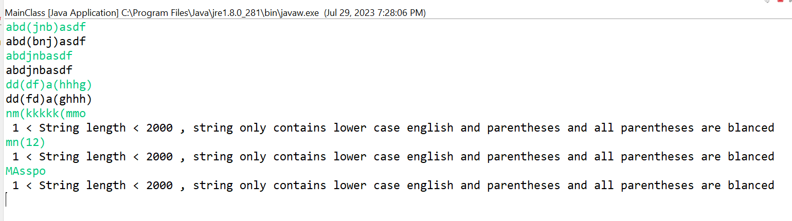
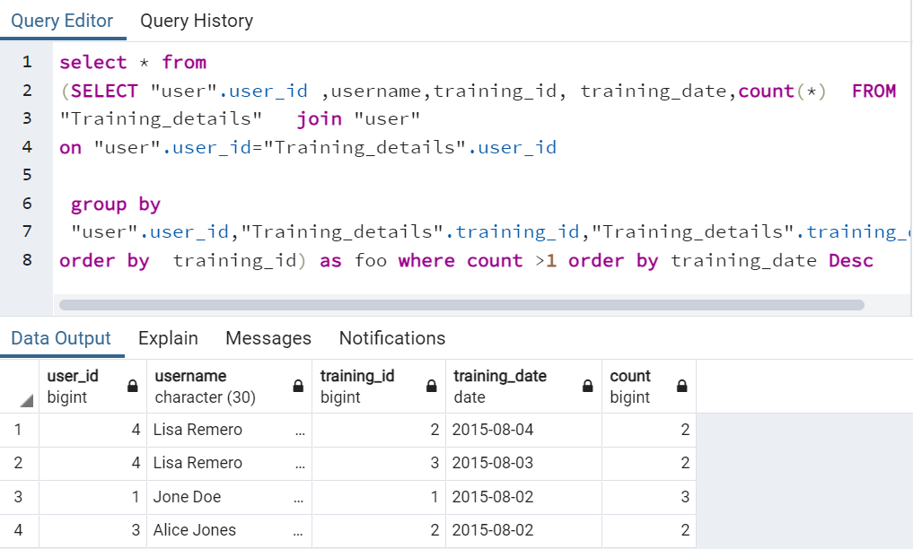
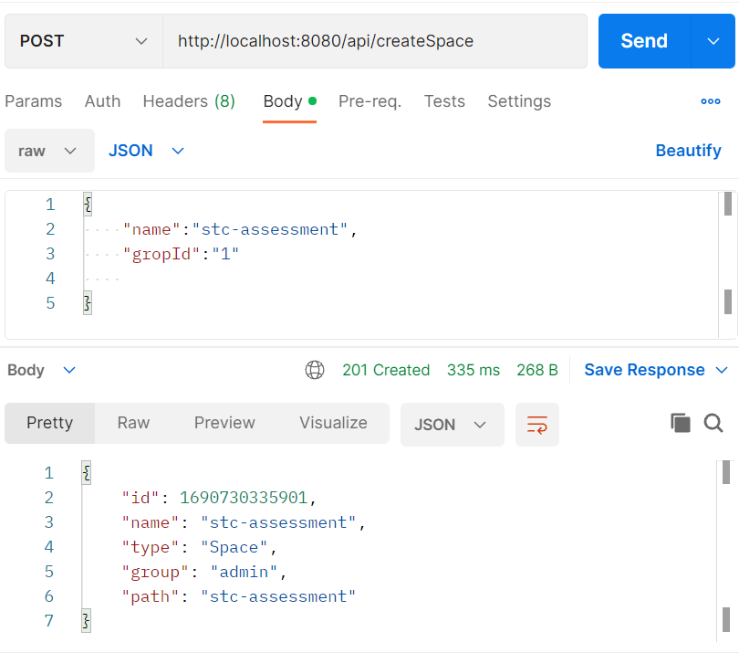
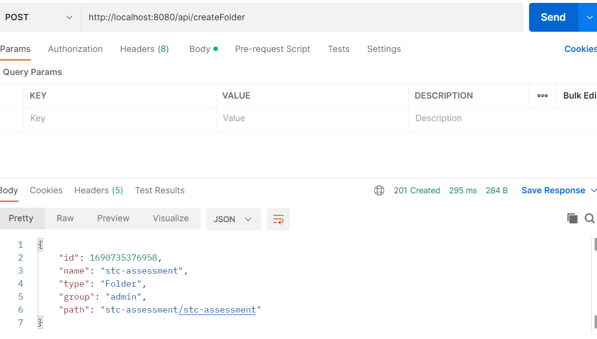
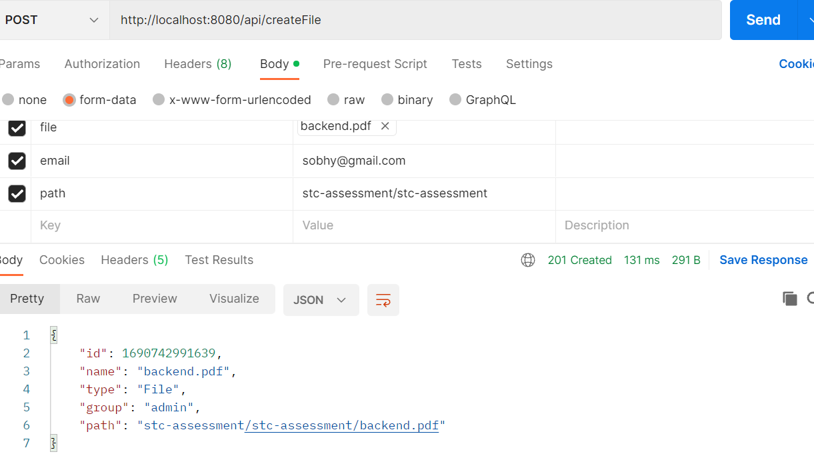
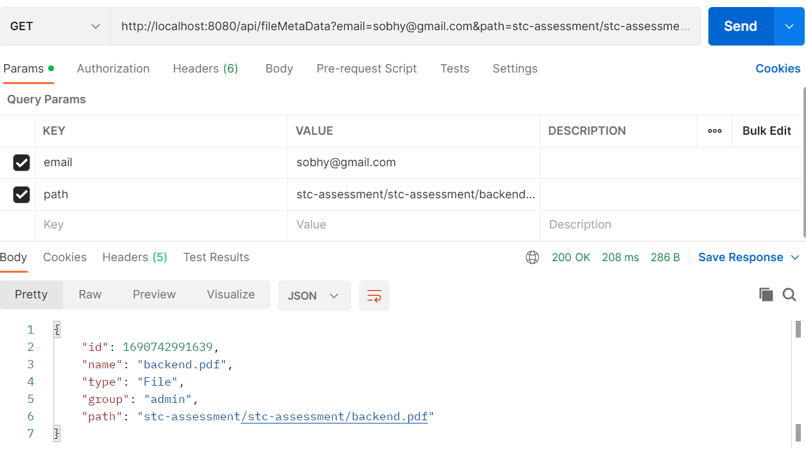

# Problem Solving
 ```
public static void main(String args[]){
        Scanner scanner = new Scanner(System.in);
        String s = scanner.nextLine();
        if(s.isEmpty() || s.length() > 2000 || !s.matches("([a-z]*\\(([a-z]+)\\))*[a-z]*"))
        {
            System.out.println(" 1 < String length < 2000 , string only contains lower case english and parentheses and all parentheses are blanced");
        }
        else {
            Pattern p = Pattern.compile("\\((\\w+)\\)");
            StringBuilder x = new StringBuilder();
            x.append(s);
            Matcher m = p.matcher(x);
            while (m.find()) {
                String cc = StringUtils.substring(s, m.start() + 1, m.end() - 1);
                x.replace(m.start()+1, m.end()-1, StringUtils.reverse(cc));
            }
            System.out.println(x.toString());
        }
    }

}
  
  ```
## Output
  

# Database Query
  ```
  select * from 
(SELECT "user".user_id ,username,training_id, training_date,count(*)  FROM 
"Training_details"   join "user"
on "user".user_id="Training_details".user_id

 group by 
 "user".user_id,"Training_details".training_id,"Training_details".training_date
order by  training_id) as foo where count >1 order by training_date Desc
  ```
## Output
  

# System desgin 

## API to create Space
  ```
curl --location --request POST 'http://localhost:8080/api/createSpace' \
--header 'Content-Type: application/json' \
--data-raw '{
    "name":"stc-assessment",
    "gropId":"1"
    
}'
  ```
### output 
  

## API to create Folder
  ```
curl --location --request POST 'http://localhost:8080/api/createFolder' \
--header 'Content-Type: application/json' \
--data-raw '{
    "name":"stc-assessment",
    "gropId":"1",
    "userEmail":"sobhy@gmail.com",
    "path":"stc-assessment"
    
}'
  ```
### output 
 

## API to create File
  ```
curl --location --request POST 'http://localhost:8080/api/createFile' \
--form 'file=@"/C:/Users/SobhyAhmedM/Downloads/backend.pdf"' \
--form 'email="sobhy@gmail.com"' \
--form 'path="stc-assessment/stc-assessment"'
  ```
### output 
 

## API Get File MetaData
  ```
curl --location --request GET 'http://localhost:8080/api/fileMetaData?email=sobhy@gmail.com&path=stc-assessment/stc-assessment/backend.pdf'
  ```
### output 
  
 
 ## API Get File Download
  ```
http://localhost:8080/api/fileMetaData?email=sobhy@gmail.com&path=stc-assessment/stc-assessment/backend.pdf
  ```
### output 
 
 